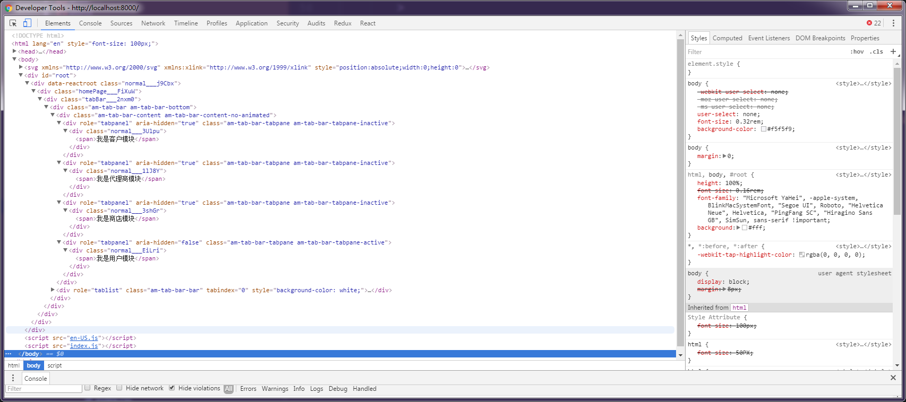

# AntMobileDemo
#### ant-mobile TabBar 组件配合 react-router-redux 的最佳实践，坚定的眼神:)

故事背景： 最近在使用ant-mobile开发web app 应用，遇到TabBar组件切换问题，在ant-mobile的issues中搜到一些实践案例，但是感觉并没有完美解决这个问题，经过思考找出了下面这个最佳实践。你需要关注的几个文件及代码：

#### src/router/router.js

```
<Router history={history}>
            <Route path='/' component={IndexPage}>
                <IndexRedirect to="/login"/>
                <Route path='/login' component={Login}/>
                <Route path='/home' component={HomePage}/>
                <Route component={HomePage}>
                    <Route path='/customer/:type' component={Customer}/>
                    <Route path='/agent/:type' component={Agent}/>
                    <Route path='/store/:type' component={Store}/>
                    <Route path='/user/:type' component={User}/>
                </Route>
                <Route path="/*" component={NotFoundPage}/>
            </Route>
        </Router>
```

#### src/components/Common/TabBarNav/TabBarNav.js

```
<TabBar
    unselectedTintColor="#949494"
    tintColor="#33A3F4"
    barTintColor="white"
    hidden={this.state.hidden}
>
    <TabBarItem
        title={formatMessage(messages.customer)}
        key='customer'
        icon={<Icon type={shoppingCart} size="md" />}
        selectedIcon={<Icon type={shoppingCart} color={selectIconColor} size="md" />}
        selected={this.state.selectedTab === 'blueTab'}
        onPress={() => {
            this.setState({
                selectedTab: 'blueTab',
            });
            dispatch(routerRedux.push('/customer/customer'));
        }}
        data-seed="logId"
    >
        {tabBarChildren.props.params.type=='customer' ? tabBarChildren:null}
    </TabBarItem>
    <TabBarItem
        icon={<Icon type={dollar} size="md" />}
        selectedIcon={<Icon type={dollar} color={selectIconColor} size="md" />}
        title={formatMessage(messages.agent)}
        key="agent"
        selected={this.state.selectedTab === 'redTab'}
        onPress={() => {
            this.setState({
                selectedTab: 'redTab',
            });
            dispatch(routerRedux.push('/agent/agent'));
        }}
        data-seed="logId1"
    >
        {tabBarChildren.props.params.type=='agent' ? tabBarChildren:null}
    </TabBarItem>
    <TabBarItem
        icon={<Icon type={home} size="md"/>}
        selectedIcon={<Icon type={home} color={selectIconColor} size="md"/>}
        title={formatMessage(messages.store)}
        key='store'
        selected={this.state.selectedTab === 'greenTab'}
        onPress={() => {
            this.setState({
                selectedTab: 'greenTab',
            });
            dispatch(routerRedux.push('/store/store'));
        }}
    >
        {tabBarChildren.props.params.type=='store' ? tabBarChildren:null}
    </TabBarItem>
    <TabBarItem
        icon={<Icon type={user} size="md"/>}
        selectedIcon={<Icon type={user} color={selectIconColor} size="md"/>}
        title={formatMessage(messages.me)}
        key='me'
        selected={this.state.selectedTab === 'yellowTab'}
        onPress={() => {
            this.setState({
                selectedTab: 'yellowTab',
            });
            dispatch(routerRedux.push('/user/user'));
        }}
    >
        {tabBarChildren.props.params.type=='user' ? tabBarChildren:null}
    </TabBarItem>
</TabBar>
```

大功告成，这样既可实现通过react-router-redux控制路由跳转，进一步控制相应的组件渲染，详细代码可以查看相应的文件。

#### 番外篇：

下面解释下，在router.js中为什么使用```<Route path='/customer/:type' component={Customer}/>``` type 参数？
TabBar标准使用姿势是：
```
<TabBar>
  <TabBar.Item><Component1 /></TabBar.Item>
  <TabBar.Item><Component2 /></TabBar.Item>
</TabBar>
```
这样在切换不同tab项的时候，其他的组件也会渲染，只是给隐藏了起来，就像这样：



